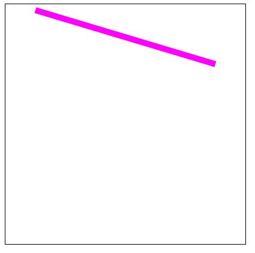

# 01-Canvas学习——绘制线段

> 2018-12-18

> 深圳


## 1、绘制简单直线

```js
    <script>
        var c = document.getElementById("myCanvas");
        var ctx = c.getContext("2d");

        // 绘制简单直线
        function drawScreen(){
            ctx.lineWidth = 10;     // 改变线条的粗细
            ctx.strokeStyle="#FF00FF";  // 改变线条的颜色（默认为黑色）
            ctx.moveTo(50,10);     // 起始点
            ctx.lineTo(350,100);    // 第二点（如果是一条直线的话则是终点）
            ctx.stroke();
        }

        window.onload = function() {
            drawScreen();
        }
    </script>
```

效果图：



## 2、beginPath()和closePath()

- **beginPath()** ：开始一个新的绘制路径。每次绘制新的路径前务必调用该方法，它将重置内存中现有的路径
- **closePath()**：如果当前的绘制路径是打开的，则关闭该绘制路径。此外，它会尝试用直线连接当前端点与起始端点来关闭路径。如果图形已关闭（如已调用`stroke()`）或者只有一个点，则它什么也不做

> 为了避免不必要的错误，建议`beginPath()`和`closePath()`成对出现

### 2.1 先stroke()后closePath()

```js
<script>
        var c = document.getElementById("myCanvas");
        var ctx = c.getContext("2d");

        // 绘制较复杂直线
        function drawLine_1() {
            ctx.lineWidth=4;
            ctx.strokeStyle="#FF00FF";
            
            ctx.beginPath();
            ctx.moveTo(50,10);
            ctx.lineTo(150,10);
            ctx.lineTo(150,200);
            ctx.lineTo(200,200);
            ctx.lineTo(200,150);
            ctx.stroke();
            ctx.closePath();
        }

        window.onload = function() {
            drawLine_1();
        }
    </script>
```


效果图：

后closePath().JPG)

### 2.2 先closePath()后stroke()

```js
<script>
        var c = document.getElementById("myCanvas");
        var ctx = c.getContext("2d");

        // stroke() 与 closePath()先后顺序对比
        function drawLine_2() {
            ctx.lineWidth=4;
            ctx.strokeStyle="#FF00FF";
		   // 先stroke()后closePath()
            ctx.beginPath();
            ctx.moveTo(50,10);
            ctx.lineTo(150,10);
            ctx.lineTo(150,200);
            ctx.lineTo(200,200);
            ctx.lineTo(200,150);
            ctx.stroke();
            ctx.closePath();
		   // 先closePath()后stroke()
            ctx.strokeStyle="blue";
            ctx.beginPath();
            ctx.moveTo(250,10);
            ctx.lineTo(350,10);
            ctx.lineTo(350,200);
            ctx.lineTo(400,200);
            ctx.lineTo(400,150);
            ctx.closePath();
            ctx.stroke();
        }

        window.onload = function() {
            drawLine_2();
        }
    </script>
```

效果图：

后closePath().JPG)

## 3、小结

| 属性或方法  |                         基本描述                          |
| :---------: | :-------------------------------------------------------: |
| strokeStyle |          用于设置画笔绘制路径的颜色、渐变和模式           |
|  lineWidth  |                    定义绘制线条的宽度                     |
| beginPath() |                   开始一个新的绘制路径                    |
| moveTo(x,y) | 移动画笔到指定的坐标点`(x,y)`，该点就是新的子路径的起始点 |
| lineTo(x,y) |         使用直线边接当前端点和指定的坐标点`(x,y)`         |
|  stroke()   |             沿着绘制路径的坐标点顺序绘制直线              |
| closePath() |      如果当前的绘制路径是打开的，则关闭掉该绘制路径       |

