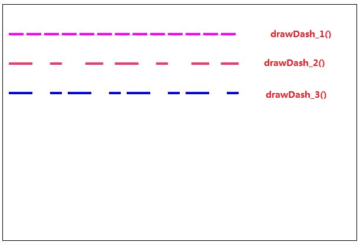
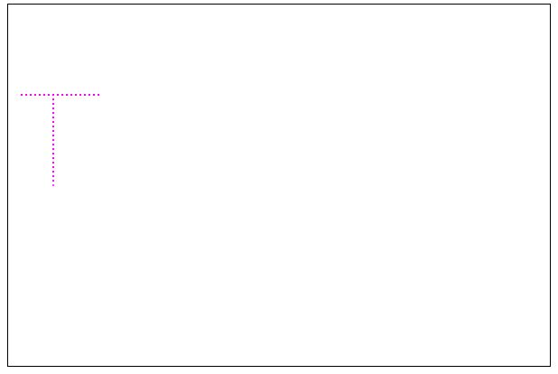

#    02-Canvas学习——绘制虚线和圆点线

> 2018-12-18

> 深圳

## 1、绘制虚线

**ctx.setLineDash(segments);**

- segments：一个`Array`数组
  - 一组描述交替绘制线段和间距长度的数字
  - 如果数组元素的数量是奇数，数组元素会被复制并重复。例如：[5,15,25]会变成[5,15,25,5,15,25]

```js
<script>
        var c = document.getElementById("myCanvas");
        var ctx = c.getContext("2d");

        // 绘制虚线
        function drawDash_1() {
            ctx.setLineDash([25, 5]);
            ctx.lineWidth = 4;
            ctx.strokeStyle = "#FF00FF";

            ctx.beginPath();
            ctx.moveTo(10,50);
            ctx.lineTo(400,50);
            ctx.stroke();
            ctx.closePath();
        }

        function drawDash_2(){
            ctx.lineWidth = 4;
            ctx.beginPath();
            ctx.setLineDash([40,30,20]);
            ctx.strokeStyle="#f36";
            ctx.moveTo(10,100);
            ctx.lineTo(400,100);
            ctx.stroke();
            ctx.closePath();
        }

        
        function drawDash_3(){
            ctx.lineWidth = 4;
            ctx.beginPath();
            ctx.setLineDash([40,30,20,10]);
            ctx.strokeStyle="blue";
            ctx.moveTo(10,150);
            ctx.lineTo(400,150);
            ctx.stroke();
            ctx.closePath();
        }

        window.onload = function () {
            drawDash_1();
            drawDash_2();
            drawDash_3();
        }
    </script>
```

效果图：



## 2、绘制圆点线

在Canvas中没有直接绘制圆点（dotted）线的API，如此则需要特殊处理，可以通过JavaScript自行封装一个API。

```js
<script>
        var c = document.getElementById("myCanvas");
        var ctx = c.getContext("2d");

        // 绘制圆点线
        var canvasPrototype = window.CanvasRenderingContext2D && CanvasRenderingContext2D.prototype;
        canvasPrototype.dottedLine = function (x1, y1, x2, y2, interval) {
            // 间隔
            if (!interval) {
                interval = 5;
            }

            //  是否为横向排布
            var isHorizontal = true;

            if (x1 === x2) {
                isHorizontal = false;
            }

            // 总长度
            var len = isHorizontal ? x2 - x1 : y2 - y1;
            this.moveTo(x1, y1);

            // 当前长度
            var progress = 0;

            while (len > progress) {
                progress += interval;
                if (len < progress) {
                    progress = len;
                }

                if (isHorizontal) {
                    this.fillStyle="#FF00FF";
                    this.moveTo(x1 + progress, y1);
                    this.arc(x1 + progress, y1, 1, 0, Math.PI * 2, true);
                    this.fill();
                } else {
                    this.fillStyle="#FF00FF";
                    this.moveTo(x1, y1 + progress);
                    this.arc(x1, y1 + progress, 1, 0, Math.PI * 2, true);
                    this.fill();
                }
            }
        }
        
        function drawLineDotted() {
            ctx.dottedLine(10,100,100,100);     // 横向（水平）
            ctx.dottedLine(50,100,50,200);     // 竖向（垂直）
        }

        window.onload = function () {
            drawLineDotted();
        }
    </script>
```

效果图：



