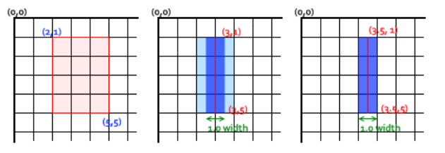
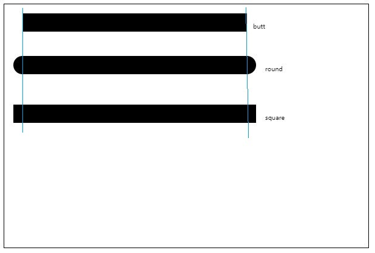
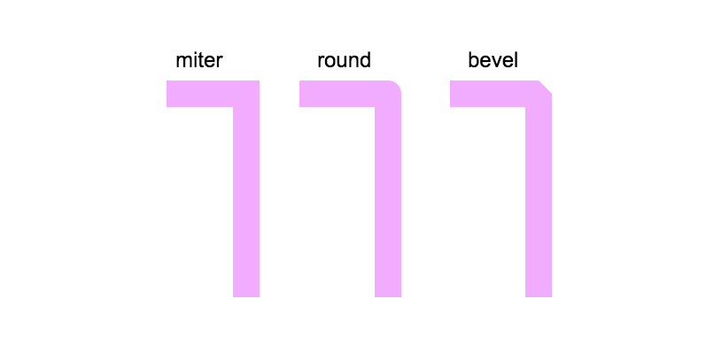

#    03-Canvas学习——绘制线型

> 2018-12-18

> [参考链接](https://www.w3cplus.com/canvas/canvas-line-style.html)

> 深圳

Canvas线型主要包括**线宽**、**线段端点**和**线段终点**

## 1、线宽

什么是线宽？——**在路径的两边各绘制线宽的一半**



> 特别注意：
>
> 1.在Canvas中绘制`1`个像素的线条时，坐标需要错开`0.5`像素
>
> 2.在Canvas中绘制路径（线段）时，后面显示设置的`lineWidth`会覆盖前面的值

## 2、线段端点

在绘制线段时，可以控制线段端点，这个线段端点也称为**线帽** 

**context.lineCap**

- `butt`：**默认**，线段末端以方形结束
- `round`：线段末端以圆形结束
- `square`：线段末端以方形结束，但是增加了一个高度和线段相同，宽度是线段高度一半的矩形

```js
<script>
        var c = document.getElementById("myCanvas");
        var ctx = c.getContext("2d");

        // 线段端点
        function drawLineCap_1() {
            ctx.lineWidth = 30;

            // 线段端点-butt
            ctx.beginPath();
            ctx.lineCap = "butt";
            ctx.moveTo(30, 30);
            ctx.lineTo(400, 30);
            ctx.fillText("butt", 410, 40);
            ctx.stroke();
            ctx.closePath();

            // 线段端点-round
            ctx.beginPath();
            ctx.lineCap = "round";
            ctx.moveTo(30, 100);
            ctx.lineTo(400, 100);
            ctx.fillText("round", 430, 110);
            ctx.stroke();
            ctx.closePath();

            // 线段端点-square
            ctx.beginPath();
            ctx.lineCap = "square";
            ctx.moveTo(30, 180);
            ctx.lineTo(400, 180);
            ctx.fillText("square", 430, 190);
            ctx.stroke();
            ctx.closePath();
        }

        window.onload = function () {
            drawLineCap_1();
        }
    </script>
```

效果图：



## 3、线段连接点

每两条线段相交的点就是**线段的连接点** 

**context.lineJoin**

- `round`：圆角
- `bevel`：斜切角
- `miter`：直角



## 4、小结

| 属性       | 描述                         | 取值                | 默认值 |
| ---------- | ---------------------------- | ------------------- | ------ |
| lineWidth  | 设置线段宽度                 | 非零的正数          | 1.0    |
| lineCap    | 线段端点形状                 | butt、round、square | butt   |
| lineJoin   | 线段连接点如何绘制           | bevel、miter、round | miter  |
| miterLimit | 斜线长度与二分之一线宽的比值 | 非零的正数          | 10.0   |

