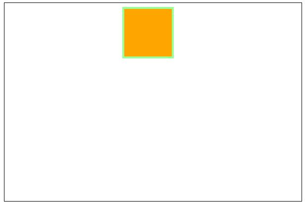
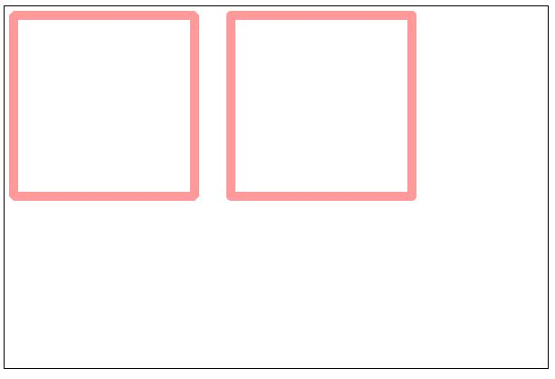
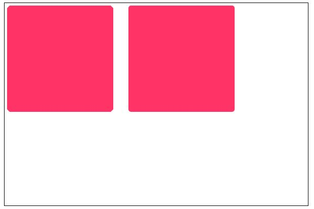
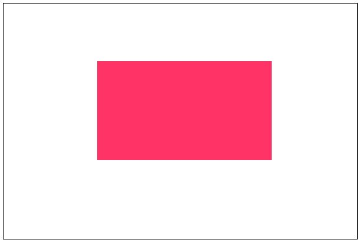

#    05-Canvas学习——绘制矩形

> 2018-12-19

> [参考链接](https://www.w3cplus.com/canvas/drawing-rectangular.html)

> 深圳

Canvas提供的绘制矩形的API：

- `fillRect(x, y, width, height)`：绘制一个填充的矩形
- `strokeRect(x, y, width, height)`：绘制一个矩形的边框
- `clearRect(x, y, width, height)`：清除指定矩形区域

## 1、同时绘制有边框和填充色的矩形

 

```js
    <script>
        var c = document.getElementById("myCanvas");
        var ctx = c.getContext("2d");

        function drawRect_1() {
            ctx.lineWidth=4;
            ctx.fillStyle="orange";
            ctx.fillRect(242,12,96,96);
            ctx.strokeStyle="#9f9";
            ctx.strokeRect(240,10,100,100);
        }
        
        window.onload = function () {
            drawRect_1();
        }
    </script>
```

效果图：



## 2、绘制折角或圆角矩形

我们可以利用`lineJoin`来改变线段的连接端点的形状

第一步：绘制斜角和圆角的矩形框

```js
<script>
        var c = document.getElementById("myCanvas");
        var ctx = c.getContext("2d");

        function drawRect_2() {
            ctx.lineWidth=10;
            ctx.strokeStyle="#F99";

            ctx.lineJoin="bevel";
            ctx.strokeRect(10,10,200,200);

            ctx.lineJoin="round";
            ctx.strokeRect(250,10,200,200);
        }
        
        window.onload = function () {
            drawRect_2();
        }
    </script>
```

效果图：



第二步：绘制填充矩形

```js
<script>
        var c = document.getElementById("myCanvas");
        var ctx = c.getContext("2d");
        
        // 绘制填充矩形
        function drawRect_3() {
            ctx.lineWidth=10;
            ctx.strokeStyle="#F36";
            ctx.fillStyle="#F36";

            ctx.lineJoin="bevel";
            ctx.strokeRect(10,10,200,200);
            ctx.fillRect(15,15,190,190);

            ctx.lineJoin="round";
            ctx.strokeRect(250,10,200,200);
            ctx.fillRect(255,15,190,190);
        }

        window.onload = function () {
            drawRect_3();
        }
    </script>
```

效果图：



## 3、通过JS拖拽绘制矩形

```js
<script>
        var c = document.getElementById("myCanvas");
        var ctx = c.getContext("2d");

        // 通过JS拖拽绘制矩形
        var rect = {},
            drag = false;
        // 第一步：监听画布上的鼠标事件
        c.addEventListener('mousedown', mouseDown, false);
        c.addEventListener('mouseup', mouseUp, false);
        c.addEventListener('mousemove', mouseMove, false);

        // 第二步：mouseDown()函数
        function mouseDown(e) {
            rect.startX = e.pageX - this.offsetLeft;
            rect.startY = e.pageY - this.offsetTop;
            drag = true;
        }
        // 第三步：mouseUp()函数
        function mouseUp() {
            drag = false;
        }
        // 第四步：mouseMove()函数
        function mouseMove(e) {
            if (drag) {
                rect.w = (e.pageX - this.offsetLeft) - rect.startX;
                rect.h = (e.pageY - this.offsetTop) - rect.startY;
                ctx.clearRect(0, 0, c.width, c.height);
                drawRect_4("fill");
            }
        }

        function drawRect_4(type) {
            if (type === "fill") {
                ctx.fillStyle="#F36";
                ctx.fillRect(rect.startX, rect.startY, rect.w, rect.h);
            } else if (type === "stroke") {
                ctx.strokeStyle="#F36";
                ctx.strokeRect(rect.startX, rect.startY, rect.w, rect.h);
            }
        }
    </script>
```

效果图：



## 4、小结

- 使用Canvas中的路径`moveTo()`、`lineTo()`配合`fill()`和`stroke()`绘制矩形
- 使用Canvas中的`rect(x,y,width,height)`配合`fill()`和`stroke()`绘制矩形
- 使用Canvas中的`fillRect(x,y,width,height)`绘制一个填充的矩形
- 使用Canvas的`strokeRect(x,y,width,height)`绘制一个边框矩形
- 使用`clearRect(x,y,width,height)`清除画布