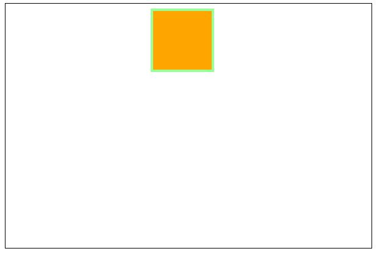
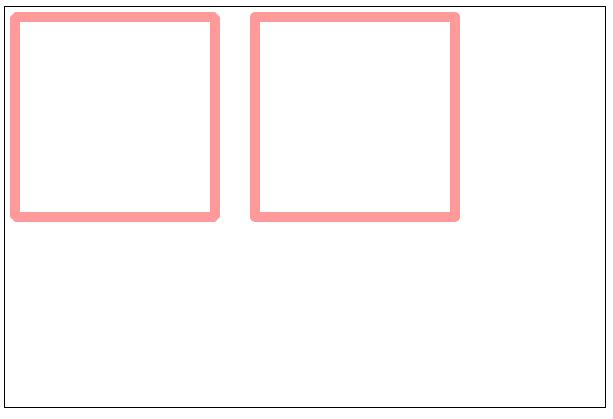

#    05-Canvas学习——绘制矩形

> 2018-12-19

> 深圳

Canvas提供的绘制矩形的API：

- `fillRect(x, y, width, height)`：绘制一个填充的矩形
- `strokeRect(x, y, width, height)`：绘制一个矩形的边框
- `clearRect(x, y, width, height)`：清除指定矩形区域

## 1、同时绘制有边框和填充色的矩形

 

```js
    <script>
        var c = document.getElementById("myCanvas");
        var ctx = c.getContext("2d");

        function drawRect_1() {
            ctx.lineWidth=4;
            ctx.fillStyle="orange";
            ctx.fillRect(242,12,96,96);
            ctx.strokeStyle="#9f9";
            ctx.strokeRect(240,10,100,100);
        }
        
        window.onload = function () {
            drawRect_1();
        }
    </script>
```

效果图：



## 2、绘制折角或圆角矩形

我们可以利用`lineJoin`来改变线段的连接端点的形状

第一步：绘制斜角和圆角的矩形框

```js
<script>
        var c = document.getElementById("myCanvas");
        var ctx = c.getContext("2d");

        function drawRect_2() {
            ctx.lineWidth=10;
            ctx.strokeStyle="#F99";

            ctx.lineJoin="bevel";
            ctx.strokeRect(10,10,200,200);

            ctx.lineJoin="round";
            ctx.strokeRect(250,10,200,200);
        }
        
        window.onload = function () {
            drawRect_2();
        }
    </script>
```

效果图：



