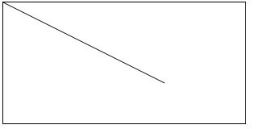
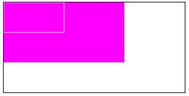
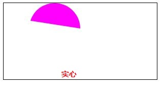
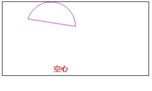
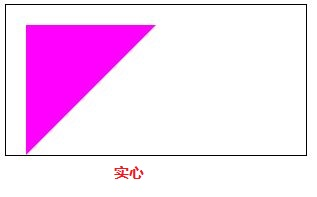
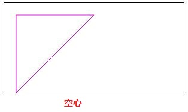
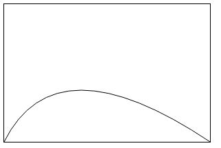
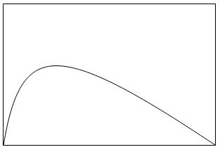
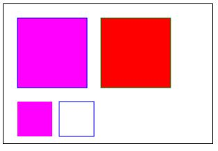
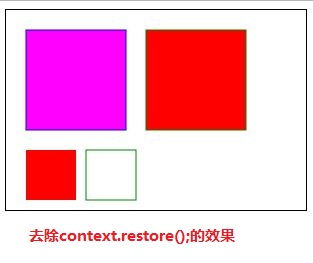

## Canvas学习笔记

> 2018-12-17

> 深圳

## 1.初识Canvas

canvas元素本身并不能实现图形绘制功能，绘制图形的工作是由JavaScript来完成。

```html
    <canvas id="myCanvas" width="300" height="150" style="border:1px solid;">
        您的浏览器不支持Canvas,请更新或更换浏览器！
    </canvas>
```

## 2.Canvas绘制简单图形

### 2.1 绘制直线

```javascript
<script>
        var c = document.getElementById("myCanvas");
        var context = c.getContext("2d");

        // 绘制直线
         context.lineWidth=10;    // 线的宽度
         context.moveTo(0,0);    // 把画笔移到Canvas画布中的某个位置（起点坐标）
         context.lineTo(200,100);    // 直线终点坐标
         context.stroke();   // 沿着绘制路径的坐标点顺序绘制直线
  </script>
```

效果图：



### 2.2 绘制矩形 

```javascript
<script>
        var c = document.getElementById("myCanvas");
        var context = c.getContext("2d");

        // 绘制矩形
        context.fillStyle = "#FF00FF";     // 指定要填充区域的颜色
        context.fillRect(0, 0, 200, 100);   // 绘制用颜色填充区域的矩形
        context.strokeStyle = "#FFFFFF";   // 描指定要绘制的轮廓（或线条）的颜色
        context.strokeRect(0, 0, 100, 50);  // 绘制轮廓（或线条）
    </script>
```

效果图：



### 2.3 绘制圆形

```javascript
<script>
        var c = document.getElementById("myCanvas");
        var context = c.getContext("2d");

        // 绘制圆形（实心）
        context.fillStyle = "#FF00FF";
        context.beginPath();    // 开始一个新的绘制路径
        // arc(x,y,radius,startAngle,endAngle,anticlockwise)方法本意是绘制弧线
        // x,y表示起点坐标
        // radius表示圆形的半径
        // startAngle,endAngle表示开始、结束的角度
        // anticlockwise表示是否按顺时针方向绘制
        context.arc(100, 50, 50, 0, 60, true);
        context.closePath();    // 如果当前的绘制路径是打开的，则关闭改绘制路径。它会尝试用直线连接当前端点与起始端点来关闭路径，但如果图形已关闭（例如调用stroke()）或者只有一个点，它什么也不做。在调用了beginPath()方法后最好对应的调用closePath()方法
        context.fill();

		// 绘制圆形（空心）
        context.strokeStyle="#FF00FF";
        context.beginPath();    // 开始绘制路径
        // arc(x,y,radius,startAngle,endAngle,anticlockwise)方法本意是绘制弧线
        // x,y表示起点坐标
        // radius表示圆形的半径
        // startAngle,endAngle表示开始、结束的角度
        // anticlockwise表示是否按顺时针方向绘制
        context.arc(100, 50, 50, 0, 60, true);
        context.closePath();    // 结束绘制路径（将图形闭合起来）
        context.stroke();
    </script>
```

效果图：





### 2.4 绘制三角形

```javascript
  <script>
		// 绘制三角形（实心）
        context.fillStyle="#FF00FF";
        context.beginPath();
        context.moveTo(20,20);
        context.lineTo(150,20);
        context.lineTo(20,150);
        context.fill();

        // 绘制三角形（空心）
        context.strokeStyle="#FF00FF";
        context.beginPath();
        context.moveTo(20,20);
        context.lineTo(150,20);
        context.lineTo(20,150);
        context.closePath();
        context.stroke();
    </script>
```

效果图：






### 2.5  清空画布

**context.clearRect(x,y,width,height);**——清除指定矩形区域内的所有图形

```html
<!DOCTYPE html>
<html lang="en">
<head>
    <meta charset="UTF-8">
    <meta name="viewport" content="width=device-width, initial-scale=1.0">
    <meta http-equiv="X-UA-Compatible" content="ie=edge">
    <title>02_绘制简单图形</title>
    <script>
        // 清空画布
        function clearMap() {
            context.clearRect(0, 0, 300, 200);
        }
    </script>
</head>
<body>
    <canvas id="myCanvas" width="300" height="150" style="border:1px solid;">
        您的浏览器不支持Canvas,请更新或更换浏览器！
    </canvas>
    <input type="button" value="清空画布" onclick="clearMap()">
    <script>
        var c = document.getElementById("myCanvas");
        var context = c.getContext("2d");

       // 绘制三角形（空心）
        context.strokeStyle = "#FF00FF";
        context.beginPath();
        context.moveTo(20, 20);
        context.lineTo(150, 20);
        context.lineTo(20, 150);
        context.closePath();
        context.stroke();
    </script>
</body>
</html>
```

### 2.6 小结

| 属性或方法  |                       基本描述                        |
| :---------: | :---------------------------------------------------: |
| strokeStyle |          设置画笔绘制路径的颜色、渐变和模式           |
|  lineWidth  |                  定制绘制线条的宽度                   |
| beginPath() |                 开始一个新的绘制路径                  |
| moveTo(x,y) | 移动画笔到指定的坐标点（x,y），该点是新的子路径的起点 |
| lineTo(x,y) |       使用直线连接当前端点和指定的坐标点（x,y）       |
|  stroke()   |           沿着绘制路径的坐标点顺序绘制直线            |
| closePath() |     如果当前的绘制路径是打开的，则关闭该绘制路径      |


## 3.绘制贝塞尔曲线

### 3.1 绘制二次方贝塞尔曲线

**context.quadraticCurveTo(cp1x,cp1y,x,y)** 

- cp1x,cp1y是控制点的坐标 
- x,y是终点坐标 

```js
    <script>
        var c = document.getElementById("myCanvas");
        var context = c.getContext("2d");

        //  开始绘制二次方贝塞尔曲线
        // context.quadraticCurveTo(cp1x,cp1y,x,y)
        // cp1x,cp1y是控制点的坐标
        // x,y是终点坐标
        context.strokeStyle="dark";
        context.beginPath();
        context.moveTo(0,200);
        context.quadraticCurveTo(75,50,300,200);
        context.stroke();
        context.globalCompositeOperation="source-over";
    </script>
```

效果图：




### 3.2 绘制三次方贝塞尔曲线

**context.bezierCurveTo(cp1x,cp1y,cp2x,cp2y,x,y);** 

- cp1x,cp1y是第一个控制点的坐标 
- cp2x,cp2y是第二个控制点的坐标 
- x,y是终点坐标 

```js
<script>
        var c = document.getElementById("myCanvas");
        var context = c.getContext("2d");

        //  开始绘制三次方贝塞尔曲线
        // context.bezierCurveTo(cp1x,cp1y,cp2x,cp2y,x,y);
        // cp1x,cp1y是第一个控制点的坐标
        // cp2x,cp2y是第二个控制点的坐标
        // x,y是终点坐标

        context.strokeStyle="dark";
        context.beginPath();
        context.moveTo(0,200);
        context.bezierCurveTo(25,50,75,50,300,200);
        context.stroke();
        context.globalCompositeOperation="source-over";
    </script>
```

效果图：



## 4.图形的变换

### 4.1保存和恢复Canvas状态

- **context.save()**——暂时将当前的状态（包括各种属性的值，变形，裁剪路径等）保存在堆中
- **context.restore()**——将上一个保存的状态从堆中再次取出来，恢复该状态的所有设置

```js
<script>
        var c = document.getElementById("myCanvas");
        var context = c.getContext("2d");

        // 开始绘制矩形
        context.fillStyle="#FF00FF";
        context.strokeStyle="blue";
        context.fillRect(20,20,100,100);
        context.strokeRect(20,20,100,100);
        context.fill();
        context.stroke();

        // 保存当前Canvas状态
        context.save();

        // 绘制另一个矩形
        context.fillStyle="#FF0000";
        context.strokeStyle="green";
        context.fillRect(140,20,100,100);
        context.strokeRect(140,20,100,100);
        context.fill();
        context.stroke();

        // 恢复第一个矩形的状态
        context.restore();

        // 绘制两个矩形
        context.fillRect(20,140,50,50);
        context.strokeRect(80,140,50,50);
    </script>
```

效果图：





### 4.2 移动坐标空间

**translate（dx,dy）**

- dx ——坐标原点沿水平方向的偏移量
- dy——坐标原点沿垂直方向的偏移量

画布坐标空间默认以画布左上角（0,0）为原点，但在绘制图形时可以使用translate（dx,dy）方法移动坐标空间，使画布的变换矩阵在水平和垂直方向发生偏移。

```
在图形变换之前，最好先使用save( )方法保存当前状态，因为使用restore( )方法自动恢复原来的状态即简单又高效，特别是当重复某种运算时。
```


